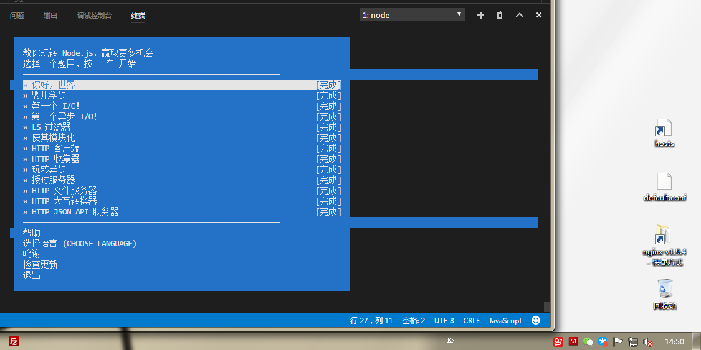

# [NodeSchool](https://nodeschool.io) 之 learnyounode 
- [x] 完成有生之年补全任务之一
- [emoji](https://www.webpagefx.com/tools/emoji-cheat-sheet/):smile:
- 还有究竟是谁给我挖的坑？:neckbeard: :flushed:  
ps.markdown的复选框究竟能好好支持么=。=

## 总结
* `process.argv` ,用法是 第一个是node 第二个是脚本文件 第三个及* 终端输入信息
* `fs` 对系统文件及目录进行读写操作
* `path` 处理文件路径工具
* `http` 封装的http服务器和http客户端 
* `net` 底层的网络通信工具,包含创建服务器、客户端 

学完大概了解几个node模块能做些什么，然后就没有了，还要自己多去练练了，毕竟还有一堆模块呢。